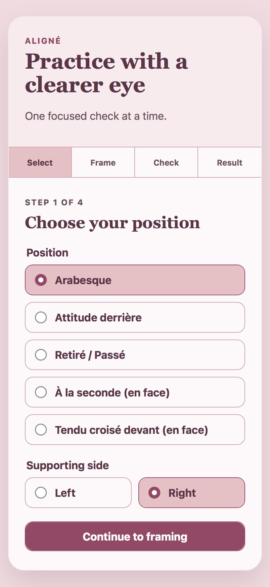
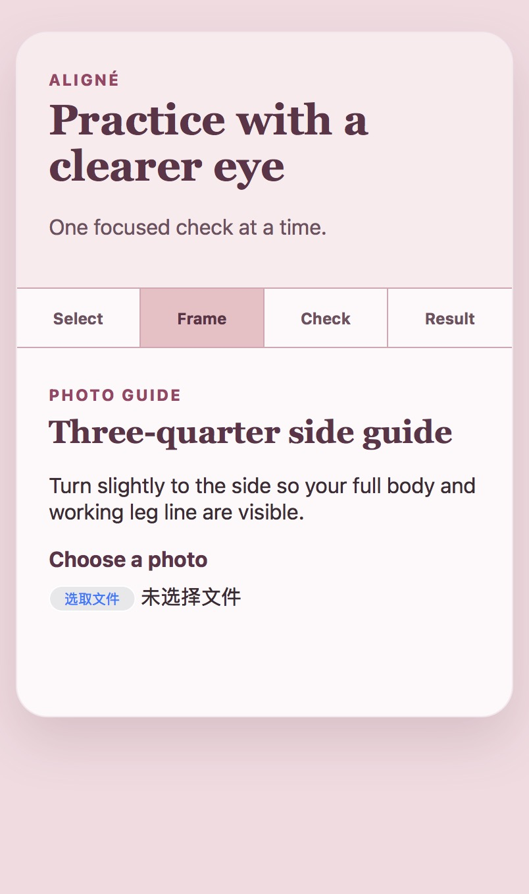
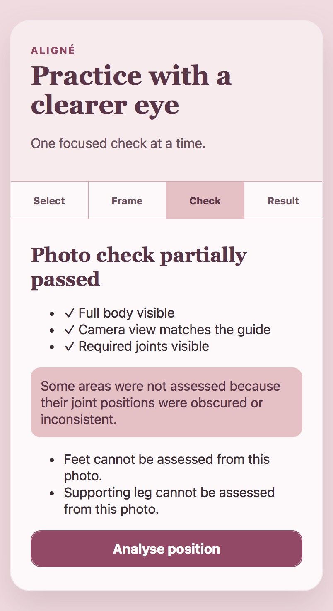
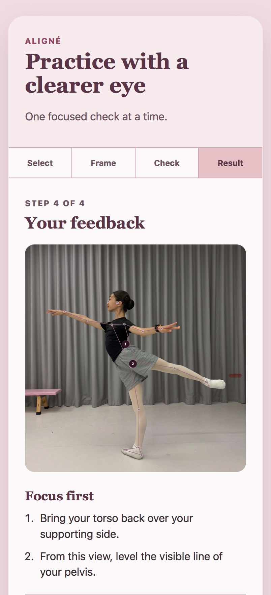

# ALIGNÉ ballet feedback MVP

## What ALIGNÉ does

ALIGNÉ is a browser-based ballet practice assistant that turns a single full-body photo into focused correction suggestions and an annotated image of the dancer's pose. The dancer selects a ballet position and supporting side, follows the recommended camera-angle and framing guidance, and uploads a photo. ALIGNÉ first checks whether the required body areas are visible, then applies position-specific standards to the detected body landmarks. The result highlights relevant areas on the photo and prioritizes practical adjustments for that particular position.

## Supported positions

The current MVP supports five ballet positions, each with its own evaluation criteria, feedback, and recommended camera view:

- Arabesque — three-quarter side view.
- Attitude derrière — three-quarter side view.
- Retiré / Passé — front view.
- À la seconde — front view.
- Tendu croisé devant — front view.

## What it can identify

Depending on the selected position and which landmarks are reliably visible, ALIGNÉ can identify issues such as whether a knee needs to straighten, an arm could extend farther, the overall line could be smoother, the torso and centre need to return over the supporting leg, or the visible line of the pelvis needs to become more level. It deliberately leaves obscured or uncertain areas unassessed instead of guessing.

## The problem it addresses

A professional ballet teacher cannot always be present during practice at home. ALIGNÉ provides an accessible between-lessons aid that helps dancers examine a photo, identify a small number of visible priorities, and practise with clearer intent. It is designed to support independent practice, not replace personalised instruction from a qualified teacher.

## Current result

The MVP implements an end-to-end four-step flow: select a position, follow its framing guide, check whether the photo is assessable, and receive prioritised feedback with an annotated result image.

<table>
  <tr>
    <td align="center"><br><sub>1. Select a position and supporting side</sub></td>
    <td align="center"><br><sub>2. Follow the position-specific framing guide</sub></td>
  </tr>
  <tr>
    <td align="center"><br><sub>3. Check photo quality and landmark visibility</sub></td>
    <td align="center"><br><sub>4. Review focused corrections and the annotated pose</sub></td>
  </tr>
</table>

This is a working MVP, but its coaching accuracy has not yet been validated on a sufficiently diverse real-photo dataset. The screenshots demonstrate the implemented workflow and output rather than a claim of teacher-level assessment.

## Future improvements

Future work can expand ALIGNÉ to more ballet positions, improve joint-location accuracy across different dancers, lighting conditions, camera setups, and partial occlusions, and provide more detailed, personalised feedback that adapts to the dancer's pose, priorities, and progress over time.

## Run locally

Prerequisites: a current Node.js LTS release and pnpm.

```sh
pnpm install
pnpm dev
```

Run unit and component checks with `pnpm test`, the agreement scorer checks with `pnpm test:agreement`, and phone-sized end-to-end checks with `pnpm test:e2e`. Playwright's Chromium and WebKit browsers can be installed with `pnpm exec playwright install chromium webkit`.

The browser model assets are MediaPipe Pose Landmarker Lite files obtained through `pnpm sync:assets`. Their source is the [MediaPipe Pose Landmarker documentation](https://ai.google.dev/edge/mediapipe/solutions/vision/pose_landmarker). Do not commit downloaded model assets or participant photos.

## Supported use

The MVP supports one still image at a time:

- Arabesque and Attitude derrière: three-quarter side view.
- Retiré / Passé, À la seconde, and Tendu croisé devant: front view.
- Select the supporting side manually before uploading.

Use a full-body image, including feet, with one person and adequate lighting. The app can only discuss visible, screen-detectable features in the prescribed view. It cannot diagnose pain, injuries, force, internal rotation, muscular engagement, or hidden depth relationships. Work with a qualified teacher for coaching, health, or safety decisions.

## Privacy

There are no user accounts, saved training histories, or intentional upload persistence in this MVP. A selected image, decoded canvas, feedback, and annotated result stay in the active browser session and are released when replaced, reset, or the page closes. The release checks verify that a synthetic fixture causes no `localStorage` or IndexedDB writes and no POST request after the test services are ready. Images are not used for training or datasets by default; any future collection requires explicit opt-in consent.

## Product acceptance

See [the real-photo review protocol](evaluation/README.md). The owner must collect owned or explicitly licensed photos across all supported positions, label assessability and expected corrections before seeing the output, and score region-plus-direction agreement. At least 80% of assessable photos must have two or more Top 3 matches; unassessable cases are reported separately as quality-gate accuracy. Synthetic fixtures cannot satisfy this acceptance gate.

The current numerical image, visibility, and rule thresholds are initial engineering values. Product-owner review and qualified ballet-teacher calibration are required before treating them as coaching standards.
